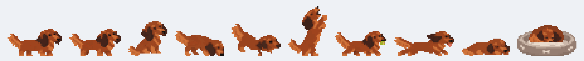
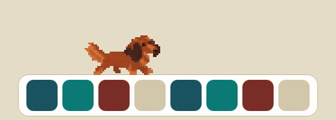

# Julie – a pixel dachshund on your Dock

**[Česky](README.cs.md)**

Julie is a tiny desktop pet for macOS: a long-haired red dachshund in chunky pixel art who lives
on top of your Dock. She is modelled on a real dog called Julie. Inspired by
[Clawd](https://zlaxrr.github.io/clawd-pet/), but written from scratch in Swift for the Mac.

She never talks – no speech bubbles, just a dog being a dog.

**[Download Julie for Mac (DMG, 0.9 MB)](https://github.com/hlaska18/Julie/releases/latest/download/Julie-1.0.1.dmg)**
· [website](https://hlaska18.github.io/Julie/) · [all releases](https://github.com/hlaska18/Julie/releases)

More animations (burrow, treats, fetch, bed, parachute, squirrel) are on the [website](https://hlaska18.github.io/Julie/).

## What she does
- walks along the top edge of the Dock (and never past its ends), sniffs, sits, lies down,
  scratches, stretches, barks (little pixel sound waves)
- digs a burrow, dives in head first, tunnels and pops out somewhere else
- sleeps curled up in her bed next to the Dock – click the bed to send her to bed or wake her up
- climbs onto windows and rides along when you move them
- pick her up with the mouse, swing her, throw her – she lands (no bouncing) and shakes herself;
  drop her from high up and she floats down on a parachute
- **treat**: press ⌃⌥P (Control-Option-P) – a dog biscuit appears at your cursor and she comes for it;
  if it is too high she begs on her hind legs
- **ball**: press ⌃⌥M or grab the ball and throw it – she fetches it and brings it back to your cursor
- **pet her**: move the cursor back and forth over her
- now and then: a squirrel to chase, a treat rain, balloons
- day mode: sleepier in the evening and at night, livelier in the morning
- optional: reacts to [Claude Code](https://claude.com/claude-code) (sits while it thinks, digs while
  it runs commands, barks when it is waiting for you, jumps when it is done)

Menu bar icon 🦴: treats, ball, bed, call her, put her to sleep (for an hour / until tomorrow /
until you turn her on again), surprises, settings, language and a short how-to.
Languages: English, Čeština, Deutsch, Slovenčina, Polski (follows your system language).

## Install
1. Download **[Julie-1.0.1.dmg](https://github.com/hlaska18/Julie/releases/latest/download/Julie-1.0.1.dmg)**, open it and drag **Julie** to **Applications**.
2. Open Julie. Because the app is not notarized by Apple, macOS will say it cannot verify the developer.
   Open **System Settings → Privacy & Security**, scroll down and click **Open Anyway**
   (or, in Terminal: `xattr -dr com.apple.quarantine /Applications/Julie.app`).
3. A welcome window shows the controls and lets you start Julie at login.

Requires macOS 12 or later, Apple Silicon or Intel. Julie lives on the main display and needs the
Dock at the bottom of the screen (with the Dock on the side or auto-hidden she hides).

**Tip:** for exact Dock edges, use 🦴 → Settings → *Measure the Dock exactly* and allow Julie in
Accessibility. Without it she estimates the Dock width from its settings.

## When she hides
In full-screen apps, when the screen is mirrored to a projector, when the main display is an external
projector while the MacBook screen is on, when the Dock is on the side or auto-hidden, while the display
sleeps or the Mac is locked, and whenever you put her to sleep from the menu. Screen sharing (e.g. Teams)
cannot be detected – use 🦴 → *Put to sleep → for an hour* before you share.

## Privacy
Julie does not use the network and collects nothing. To do her job she reads: the Dock settings,
the positions of windows (not their content, only to climb them), the cursor position, how long ago a key
was pressed (not which key) and whether a full-screen app or display mirroring is active. She stores her
settings in `~/.jezevcik/`. The Claude Code connection is optional and adds hooks to
`~/.claude/settings.json` (a backup is made; you can disconnect in Settings).

Uses a private macOS function to tell whether the current Space is a full-screen app; if Apple removes it,
Julie falls back to checking window sizes.

## Build from source
Needs only the Command Line Tools (`xcode-select --install`), Python 3 with Pillow for the art scripts.

    ./build.sh          # builds and installs into ~/Applications
    ./release.sh 1.0    # universal app + dist/Julie-1.0.dmg and .zip (runs the self-test first)
    ~/Applications/Julie.app/Contents/MacOS/Julie --test   # self-test without a screen
    python3 tools/ukazky.py     # records the GIFs in docs/ukazky from the real app (no screen recording)
    python3 tools/web_obrazky.py   # icons and sharing images for the website in docs/

The website is plain HTML in `docs/` (GitHub Pages, no build step).

Code: `Sources/` (Swift + AppKit, no dependencies). Art: `art/` – pixel-art frames generated with AI
(Higgsfield, GPT Image) from a drawing and photos of the real Julie and cut into a pixel grid by
`art/rozrez.py`.

## License
Code: [MIT](LICENSE). Artwork (pixel art of Julie, the bed, the squirrel, treats): [CC BY-NC 4.0](art/LICENSE) –
free to share and adapt, but not commercially, and with credit.

## Credits
Idea from [Clawd](https://github.com/zlaxrr/clawd-pet). Julie, her look and the wishes behind every
behaviour: Karel Hlas. Code written with Claude (Anthropic).
